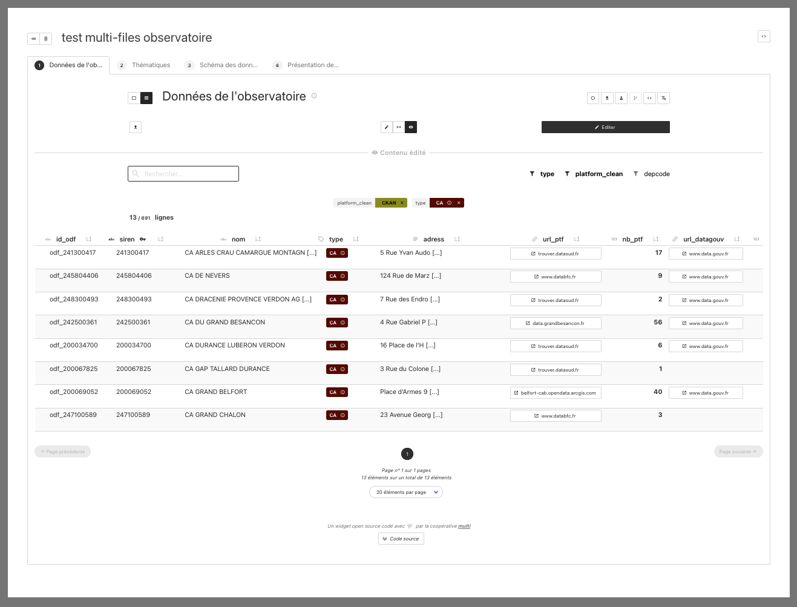
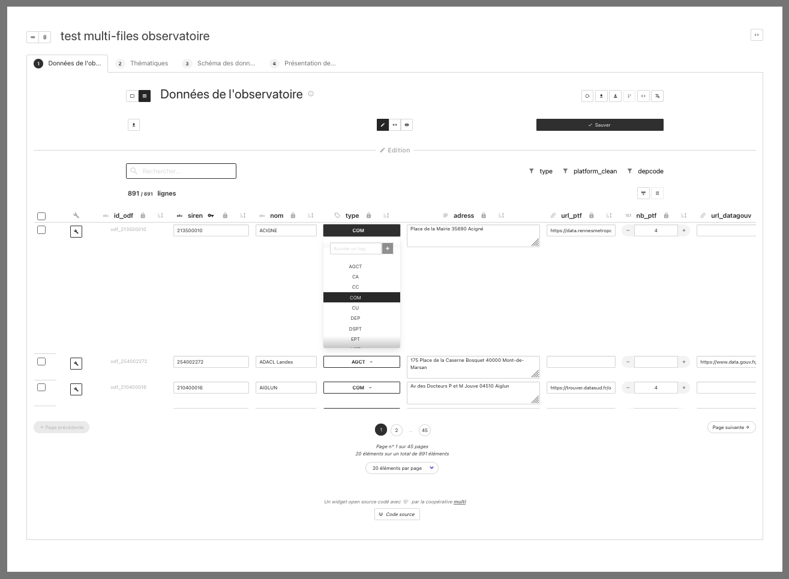
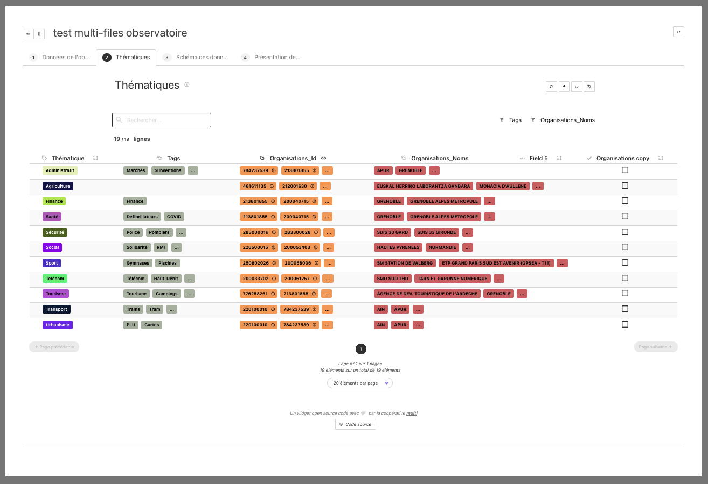

# Visualiseur des données de l'Observatoire de l'Open Data

Widget de prévisualisation des données issues de fichiers csv de l'Observatoire de l'Open Data - Open Data France.

---

## Résumé

Open Data France possède un site (https://www.observatoire-opendata.fr/) visant à mesurer le déploiement de l'open data en France, à sensibiliser les collectivitées et les acteurs publics à l'open data, et à valoriser ces données sous formes de diverses visualisations . Sont référencés sur ce site différents types de données : organisations, plateformes, etc...

Afin de pouvoir partager et de mettre en valeur toutes les ressources de ce wiki il a été proposé de créer un outil numérique de type "widget" : `gitribute-file`. En effet un outil de ce type permet de pouvoir intégrer sur des sites tiers (sites de partenaires ou autres) une sélection plus ou moins large de ressources. Cette solution permet à la fois d'éviter aux sites partenaires de "copier-coller" les ressources, d'afficher sur ces sites tiers les ressources toujours à jour, et de permettre aux sites tiers ainsi qu'au site source de gagner en visibilité, en légitimité et en qualité d'information.

L'autre avantage de cette solution est qu'elle n'est déployée qu'une fois, mais que le widget peut être intégré et paramétré/personnalisé sur autant de sites tiers que l'on souhaite... gratuitement.

La solution proposée et réalisée ici s'appuie sur un projet open source porté par la coopérative numérique [**multi**](https://multi.coop) : le projet [Gitribute](#gitribute-).

A titre de démonstration de généricité de cette solution de widget nous l'avons déclinée de différentes manières, par exemple en configurant et intégrant ce widget pour qu'il affiche des "communs" référencés sur le wiki [Résilience des territoires](https://wiki.resilience-territoire.ademe.fr).

---

## Démo

- Page html de démo : 
- url de démo :
  - gitribute-file / données observatoire ODF : https://demo-odf-data-observatoire.netlify.app/

---

## Captures d'écran

---

### Documentation 

Un site dédié à la doucmentation technique de Gitribute est consultable ici : https://gitribute-docs.multi.coop

---

## Crédits

| | logo | url |
| :-: | :-: | :-: |
| **Open Data France** |  | https://www.opendatafrance.net/ |
| **coopérative numérique multi** |  | https://multi.coop |

---

## Pour aller plus loin... 

### Gitribute

Le widget fait partie intégrante du projet [Gitribute](https://gitlab.com/multi-coop/gitribute)
